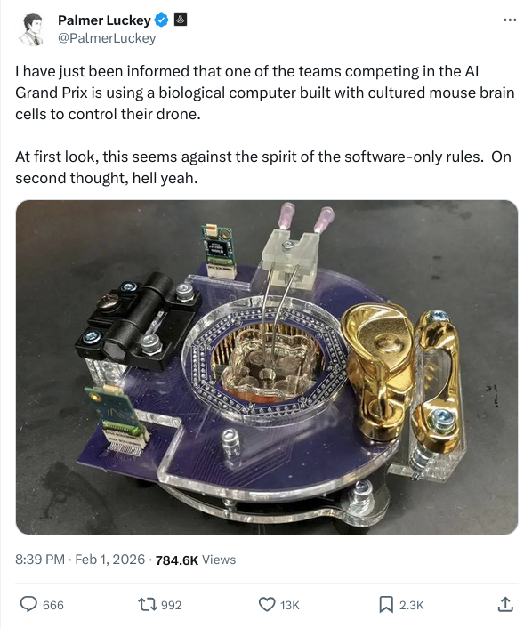

# Biological & Wetware Computing for Autonomous Drones

> Unconventional approaches to autonomous flight that push beyond traditional silicon-based AI.

## AI Grand Prix: Biological Computing Entry

Palmer Luckey has indicated openness to biological computing entries in the [AI Grand Prix](https://theaigrandprix.com):

*Source: [Palmer Luckey on X, Feb 1, 2026](https://x.com/PalmerLuckey/status/2018152238368354564?s=20)*

---

## Overview

Organoid intelligence (OI) uses living neurons grown on chips to perform computation, offering potential advantages in energy efficiency (up to 100,000x vs silicon) and adaptive learning. This emerging field bridges neuroscience, bioengineering, and robotics.

## Companies & Platforms

- [Cortical Labs](https://corticallabs.com/) - Australian startup behind DishBrain (800k neurons playing Pong in 5 min). Now shipping CL1, a desktop biological computer for code-deployable synthetic biological intelligence.
- [FinalSpark Neuroplatform](https://finalspark.com/neuroplatform/) - Swiss platform offering remote access to human brain organoids from $1k/month. Uses dopamine-based reward training with light-activated molecular cages.

## Research & Demonstrations

- [DishBrain (Cortical Labs, 2022)](https://www.cell.com/neuron/fulltext/S0896-6273(22)00806-6) - First real-time demonstration of in vitro neurons learning to play Pong using electrophysiological feedback.
- [MetaBOC Robot (Tianjin University, 2024)](https://newatlas.com/robotics/brain-organoid-robot/) - Wheeled robot controlled by pea-sized brain organoid performing obstacle avoidance and tracking.
- [Organoid Drone Navigation (Sabanci University, 2025)](https://www.neuronovai.com/academic/article/organoid-intelligence-brain-like-computation-from-living-cells/) - Successful optimization of autonomous drone navigation using organoid-based control.

## Academic Resources

- [Organoid Intelligence: The New Frontier in Biocomputing (Frontiers, 2023)](https://www.frontiersin.org/journals/science/articles/10.3389/fsci.2023.1017235/full) - Foundational roadmap for OI research from Johns Hopkins.
- [Brain Organoid Computing – An Overview (arXiv, 2025)](https://arxiv.org/html/2503.19770v1) - Comprehensive survey of wetware computing approaches and applications.
- [Hybrot (Wikipedia)](https://en.wikipedia.org/wiki/Hybrot) - Overview of hybrid biological-robotic systems dating back to 2003.

## Brain-Computer Interfaces for Drone Racing

- [Brain Drone Racing (University of Florida)](https://hxr.cise.ufl.edu/BrainDroneRace/) - World's first BCI drone racing competition using EEG-based control. Competitors out-focus opponents in cognitive endurance races.

---

[Back to main list](../README.md)
